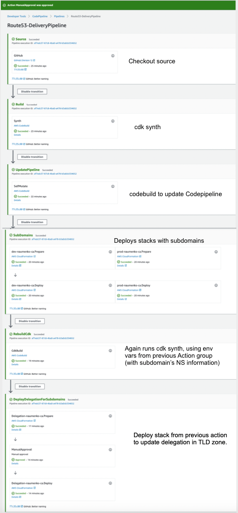

# CDK app for Route53 zones setup

This is a CDK project in Typescript to create subdomains in multiple AWS accounts (assuming they are stood up within AWS Organization, but this is not a requirement). Subdomains are delegate to apex domain (naumenko.ca)

Codepipeline features are utilized to pass NS information across AWS accounts to configure domain delegation in Route53.

It uses CDK Pipline package that is not GA yet (beginning of 2021), so there are some hacks to make it pass NS records around. Specifically, cdk synth runs two times: once to synthesize pipeline project that provisions subdomains and one more time to re-synthesize it but with actual NS servers created in previous Codepipline deployment action.

## Bootstrapping

### Create AWS accounts

AWS has native tools to manage multiple accounts in the organization, however the fastest way to do it is using this awesome project called "Org Formation". See org-formation folder for example used in this repo.

https://github.com/org-formation/org-formation-cli

Run `org-formation update organization.yml`

Add created account to ~/.aws/config, so its easier to run commands in each with assumed role using aws cli named profiles.

```
[profile cicd]
role_arn = arn:aws:iam::138847631892:role/OrganizationAccountAccessRole
source_profile = default
region = us-east-1

[profile dev]
role_arn = arn:aws:iam::164411640669:role/OrganizationAccountAccessRole
source_profile = default
region = us-east-1

[profile prod]
role_arn = arn:aws:iam::116907314417:role/OrganizationAccountAccessRole
region = us-east-1
source_profile = default
```

### Bootstrap CDK in accounts

CDK requires bootstrapping completed, before it can deploy Cloudformation into single or cross-account.   

Below commands saying "hey, aws please trust cdk to deploy CF templates into other accounts by assuming role CDK creates in these accounts with trust relation". This is a very typical and very secure access pattern for CI/CD pipelines in AWS.


```
cdk bootstrap --bootstrap-customer-key --cloudformation-execution-policies 'arn:aws:iam::aws:policy/AdministratorAccess' --trust 138847631892 aws://208334959160/us-east-1 --profile default

cdk bootstrap --bootstrap-customer-key --cloudformation-execution-policies 'arn:aws:iam::aws:policy/AdministratorAccess' --trust 138847631892 aws://116907314417/us-east-1 --profile prod

cdk bootstrap --bootstrap-customer-key --cloudformation-execution-policies 'arn:aws:iam::aws:policy/AdministratorAccess' --trust 138847631892 aws://164411640669/us-east-1 --profile dev

cdk bootstrap --bootstrap-customer-key --cloudformation-execution-policies 'arn:aws:iam::aws:policy/AdministratorAccess' aws://138847631892/us-east-1 --profile cicd

```

Then put access token into Parameter Store, so CDK can provision Codepipline that can be triggered by github commits.

```
aws ssm put-parameter --name /github/personal_access_token --value yours_github_token_ --type String
```

And finally, run `npx cdk deploy Route53-Pipeline --profile cicd`

Now push changes to your branch, Codepipeline will be triggered and deploy it automatically. 

## Codepipeline

When you run ``npx cdk deploy Route53-Pipeline` it creates following self-mutating Codepipeline.



## Check delegation 

After pipeline run without errors, check resolution for subdomains.

dig utility with +trace option will return name servers for the apex domain and sub-subdomain. 

```
dig +trace dev.naumenko.ca

; <<>> DiG 9.10.6 <<>> +trace dev.naumenko.ca
;; global options: +cmd
.			517300	IN	NS	a.root-servers.net.
.			517300	IN	NS	b.root-servers.net.
.			517300	IN	NS	c.root-servers.net.
.			517300	IN	NS	d.root-servers.net.
...
.			517300	IN	NS	m.root-servers.net.
.			517300	IN	RRSIG	NS 8 0 518400 20210121050000 20210108040000 42351 . 
...

ca.			172800	IN	NS	any.ca-servers.ca.
ca.			86400	IN	DS	2134 8 2 4B8475C0C0FE2AFDFEE1A71A237C91059098D12FC18265B290EDB238 A5F63582
...

naumenko.ca.		86400	IN	NS	ns-241.awsdns-30.com.
naumenko.ca.		86400	IN	NS	ns-776.awsdns-33.net.
naumenko.ca.		86400	IN	NS	ns-1481.awsdns-57.org.
naumenko.ca.		86400	IN	NS	ns-1913.awsdns-47.co.uk.
t8k75i4tj36jf102o518ir5q4l99kmqm.ca. 3600 IN NSEC3 1 1 5 - T8M1UC6TIL2UFI0RBGM0I9U6PO9HL5UU  NS SOA RRSIG DNSKEY NSEC3PARAM
...

dev.naumenko.ca.	172800	IN	NS	ns-1230.awsdns-25.org.
dev.naumenko.ca.	172800	IN	NS	ns-1751.awsdns-26.co.uk.
dev.naumenko.ca.	172800	IN	NS	ns-185.awsdns-23.com.
dev.naumenko.ca.	172800	IN	NS	ns-891.awsdns-47.net.
;; Received 184 bytes from 205.251.199.121#53(ns-1913.awsdns-47.co.uk) in 18 ms

dev.naumenko.ca.	900	IN	SOA	*ns-1230.awsdns-25.org.* awsdns-hostmaster.amazon.com. 1 7200 900 1209600 86400
;; Received 129 bytes from 205.251.198.215#53(ns-1751.awsdns-26.co.uk) in 18 ms
```

# Deploy sample app

TODO